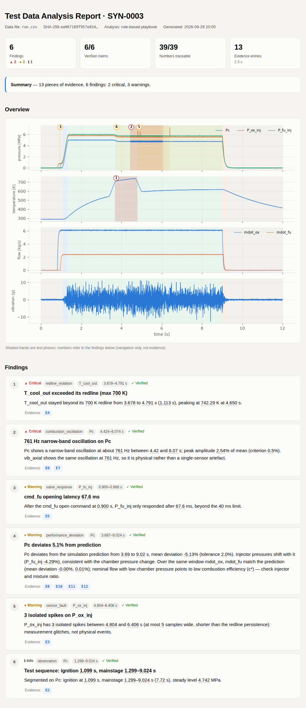

# Groundline

English | [简体中文](README.zh-CN.md)

**A verifiable AI agent for engine test data: every number in the report traces back to a reproducible computation.**

The name comes from *grounded* (every number has a source) and *redline* (limit checks).



Give Groundline the data from an engine hot-fire (or any bench test) and it segments the run into phases, checks sensor health, redlines, valve response and oscillations, compares against the simulation prediction, and writes an analysis report. Unlike a typical "AI analysis":

- **All numbers come from deterministic tools.** The LLM never sees raw samples. It only decides which tools to call and how to dig deeper, and turns their results into readable findings.
- **Every tool call goes into an evidence ledger.** The ledger records parameters, the data file's SHA-256, a hash of the tool's source code, the result and the figure. Findings may only cite these entries (E1, E2, ...).
- **A verifier checks every number in every finding.** Each number in a title or statement must be found in the evidence it cites (rounding and s↔ms, fraction↔% conversions allowed). Numbers that are not found get a red squiggle in the report, and an LLM agent gets the rejection back with one chance to fix it. The verifier also checks what a number *means*: the unit written after it (s, Hz, %, bar, N·s, ...) must match the unit of the evidence field, and a number introduced by a word such as "peak", "duration", "mean" or "impulse" must come from a field with that role (see [Semantic verification](#semantic-verification)).
- **Every finding can be reproduced.** `groundline reproduce report.json` re-runs every ledger entry on the raw data and compares the results one by one.

> Status: v0.1 prototype. Benchmarks use data from the built-in synthetic generator, plus one public real static fire of a solid motor as an example (see [Real-data example](#real-data-example-hanaro-solid-motor-static-fire)). Not yet validated on real liquid-engine test data.

## Quick start

```bash
pip install -e ".[all]"        # minimal install needs only numpy/scipy/pandas/matplotlib: pip install -e .

groundline demo                  # generate a synthetic hot-fire with anomalies and analyse it with the rule agent
open groundline_demo/report.html
groundline reproduce groundline_demo/report.json   # 13/13 evidence entries reproduced exactly
```

Analyse your own data (CSV with time in the first column; NI TDMS is supported too):

```bash
groundline analyze path/to/run.csv --reference sim.csv --limits limits.json
```

For the `limits.json` format, see the example written by `groundline synth`: redlines, redline persistence, allowed valve latency, oscillation thresholds and the tolerance for deviation from the simulation.

## Using an LLM

The rule agent (the default) is a fixed checklist and needs no model. With an LLM agent, the model plans the analysis, cross-checks and writes the findings itself.

The easiest setup is a `.env` in the project root (it is in `.gitignore` and never committed):

```bash
cp .env.example .env      # fill in OPENAI_API_KEY; change GROUNDLINE_AGENT / GROUNDLINE_LLM_MODEL as needed
groundline config         # show the configuration in effect (keys masked)
groundline demo           # from now on every command uses the agent and model from .env
```

Groundline looks for `.env` from the current directory upwards; command-line arguments and variables already set in the shell take precedence. You can also skip `.env` and use environment variables or arguments:

```bash
# OpenAI
export OPENAI_API_KEY=sk-...
groundline analyze run.csv --agent openai --model gpt-4o-mini

# Any OpenAI-compatible endpoint: Qwen, DeepSeek, vLLM, a local Ollama ...
export GROUNDLINE_LLM_BASE_URL=http://localhost:11434/v1   # e.g. Ollama
export GROUNDLINE_LLM_MODEL=qwen2.5:32b
groundline analyze run.csv --agent openai

# Anthropic
export ANTHROPIC_API_KEY=...
groundline analyze run.csv --agent anthropic --model claude-sonnet-5
```

When benchmarking an LLM agent, besides detection rates Groundline also counts **the invented numbers the verifier caught in the first draft**, the result after the fix round, and token usage:

```bash
groundline eval --agent openai --model gpt-4o-mini --n 10 --lang en --out eval_openai.json
```

With the official OpenAI endpoint the Responses API is used automatically (reasoning models such as `gpt-5.6-sol` can only reason and call tools together there); set the reasoning effort with `GROUNDLINE_LLM_REASONING_EFFORT`. Other OpenAI-compatible services use Chat Completions; force either with `GROUNDLINE_OPENAI_API=responses|chat`. No temperature is sent by default; set one with `GROUNDLINE_LLM_TEMPERATURE`.

Test data is usually sensitive, so the interface is built for on-premise deployment: the model only sees summaries of tool outputs, never the raw data.

## As an MCP server

```bash
groundline-mcp     # stdio transport; see examples/mcp_config.json
```

It exposes five tools: `open_run`, `list_analysis_tools`, `run_analysis`, `verify` and `write_html_report`. Any MCP client (Claude Desktop, Cursor or your own agent) can act as the planner; the verification rules stay the same.

## Analysis tools

| Tool | What it does |
|---|---|
| `describe_data` | Channels, sample rate, units, NaN counts |
| `segment_phases` | Splits the run into pre-test, startup, mainstage, shutdown and post-test at 10 % / 90 % of chamber pressure, and records valve command times |
| `check_sensor_health` | NaN gaps, frozen signals, isolated spikes (local robust σ) |
| `check_redlines` | Redline checks with a persistence criterion and 5 ms smoothing; short glitches are counted as suppressed transients |
| `measure_valve_response` | Latency from a valve command to the response channel moving, compared with the allowed value |
| `detect_oscillation` | Sliding-window FFT: frequency, amplitude (% of mean) and start/end of narrow-band oscillations |
| `compare_reference` | Comparison with the simulation prediction: mean deviation, RMSE and intervals of sustained deviation |
| `pulse_metrics` | Peak, action time, integral (total impulse) and mean of a pulse-shaped channel such as solid-motor thrust |
| `channel_stats` / `plot_window` | Statistics and plots for drilling down |

`groundline tools` prints the full parameter descriptions.

## Benchmarks

The synthetic generator can inject six kinds of known anomalies, always with ground truth: combustion oscillation, coolant over-temperature, a frozen or missing sensor, measurement spikes, a late fuel valve, and low chamber pressure (low c* efficiency). That makes agents measurable:

```bash
groundline eval --n 50 --seed 1000
```

Rule agent on 50 random runs:

| Anomaly | n | Recall | Category accuracy | Median start-time error |
|---|---|---|---|---|
| oscillation | 15 | 100% | 100% | 12 ms |
| overtemp | 22 | 100% | 100% | 0 ms |
| sensor_dropout | 10 | 100% | 100% | 0 ms |
| sensor_spike | 8 | 100% | 100% | 0 ms |
| valve_delay | 15 | 100% | 100% | 0 ms |
| pc_deficit | 14 | 100% | 100% | 112 ms |

Overall precision is 100%, with 0 false positives on the 4 nominal runs; 134/134 findings verified and 942/942 numbers grounded.

The LLM agent (`gpt-5.6-sol`, Responses API) on the first 14 runs of the same seeds (`--n 14 --seed 1000`, including 2 nominal runs and all six anomaly types):

| Metric | Rule agent | gpt-5.6-sol |
|---|---|---|
| Recall / category accuracy | 100% / 100% | 100% / 100% |
| Precision | 100% | 95% (1 false positive) |
| False positives on nominal runs | 0 | 0 |
| Invented numbers in first drafts | — | 0 / 376 |
| Per run | 1.6 s | 22 s, about 19k input / 1,400 output tokens |

The one false positive reports the coolant temperature lag caused by the late valve as a separate performance deviation instead of attributing it to the valve delay. With only 14 runs, one pass, and non-deterministic model output, treat these numbers as a rough guide.

The first evaluation scored only 36% precision: 35 of the 37 "false positives" were passed checks such as "valve response within limits" or "no oscillation detected" that the model had filed under an anomaly category. After adding one rule to the prompt ("a category other than observation means an anomaly was found; checks that passed use observation"), precision rose to 95%. The scoring was not changed.

### Model leaderboard

`groundline leaderboard` runs several agents / models on the same synthetic runs and summarises them in one table (`leaderboard/LEADERBOARD.md`). Models are listed in a JSON file; `examples/leaderboard.json` has the rule agent, gpt-5.6-sol and Qwen2.5 7B / 3B running locally through [Ollama](https://ollama.com) (14B needs more memory). An existing `groundline eval` result can be imported with `"from"` instead of re-running it. Results are saved after every run, so an interrupted leaderboard resumes where it stopped.

```bash
groundline leaderboard examples/leaderboard.json            # all models
groundline leaderboard examples/leaderboard.json --only "qwen2.5-7b (本地)"
```

The key column is **numbers without a source in the first draft**: numbers the verifier stopped on the first submission because they are not in the cited evidence, i.e. numbers that would have gone into the report without a verifier. Recall is computed over all runs: anomalies in runs where the model crashed or submitted nothing count as missed.

Results from 2026-09-29 (`--n 14 --seed 1000`; local models ran with Ollama on a 16 GB MacBook Pro with a 16k context; raw results in `docs/results/leaderboard/`):

| Model | Reports submitted | Recall (strict / loose) | Precision | FPs on nominal runs | First-draft numbers without a source | Still wrong after verification | s/run |
|---|---|---|---|---|---|---|---|
| Rule agent | 14/14 | 100% / 100% | 100% | 0 | – | 0 | 1.3 |
| gpt-5.6-sol | 14/14 | 100% / 100% | 95% | 0 | 0 / 376 (0%) | 0 | 22 |
| Qwen2.5 7B | 11/14 | 5% / 50% | 5% | 0 | 23 / 98 (23%), plus 4 with the wrong meaning | 26 numbers, 14 findings | 478 |
| Qwen2.5 3B | 13/14 | 0% / 0% | – | 0 | 1 / 1 | 1 number, 4 findings | 28 |

Strict recall needs the finding's channel field and time window to match; loose recall also counts a finding with no channel if its category is right and its time does not conflict (the model found the problem but did not fill in the structured field).

Qwen2.5 7B was run three times with very different results (reports submitted 11 / 7 / 11; first-draft numbers without a source 15% / 12% / 23%). The table shows the last run, the first one that stored its evidence ledger and could be re-verified with the new verifier.

On the second run we audited, one by one, the 10 numbers the verifier stopped in the 7B first drafts, recomputing the evidence from the same seeds:

- **4 were invented values**: a flow integral of 49.9994 kg written as "about 60"; a maximum deviation of about 10.3% written as 2.29%; two durations with no source ("0.86 s", "lasting 2 s").
- **6 were real values cited from the wrong evidence**: 2 of them (the mainstage start and end times) propped up a wrong claim that the coolant was over its redline for the whole mainstage, when it was only over from 3.95 to 5.91 s.
- **No false alarms**: every stopped number was a real problem. The 3B run had one false alarm, the test ID "SYN-1013" read as a number; fixed.

On the last run, semantic verification stopped 4 more numbers that *have* a source but the wrong meaning; the grounding-only verifier would have passed all of them. All 4 are real problems:

- "lasting about 0.2 s": 0.2 is the value of a flow integral, not a duration. This is exactly the "made-up number that happens to match an unrelated one" loophole.
- "mean deviation 0.069%": the 0.069 in the evidence is an absolute deviation in MPa, not a percentage.
- Two flow integrals given in "kg·s": the integral of a flow is a mass in kg.

The first time it ran on real output, semantic verification flagged 4 more numbers; the audit showed they were bugs in the verifier itself: it read compound units such as "MPa·s" and "kg/s·s" only up to the first unit. Compound units are now read whole and cancelled (kg/s·s = kg). After the fix there are still no false alarms on the 60 numbers written by gpt-5.6-sol or the 1,884 written by the rule agent.

These results also show the verifier's limits:

- **The fix round does not rescue small models.** On the last run 7B used 9 fix rounds and still had 26 problem numbers after verification. The verifier's job is to flag problems (the red squiggles in the report), not to make the model get them right.
- **Misreadings of the data are not caught.** 7B described a steady oxidiser flow as a "sharp pulse"; every number it cited was real and matched its field, so the verifier cannot see it. Before semantic verification, an invented "11 s in total" also passed because it happened to be within 1% of some number in the evidence; closing that loophole is what [semantic verification](#semantic-verification) is for.
- **Small models mostly fail to finish the task, not just invent numbers.** Every 7B run had several tests where it could not submit a report within the step or time limit; 3B mostly submitted empty reports, and a model that says nothing invents nothing. With large run-to-run variation and a small sample, treat these numbers as a rough guide.

**Take these numbers with a grain of salt.** The rule agent was tuned together with this synthetic generator, so a perfect score only shows that the pipeline is self-consistent, not that it handles real data. The benchmark is really for:

1. comparing LLM agents, and how often they invent numbers;
2. catching regressions when tools change;
3. harder scenarios: coupled anomalies, realistic noise spectra, sensor drift, and comparison with real test data.

## Real-data example: HANARO solid motor static fire

`examples/hanaro_knsb/` holds a public KNSB solid-motor static fire by SNU Rocket Team HANARO (2025; data from [snu-hanaro/static-fire-toolkit](https://github.com/snu-hanaro/static-fire-toolkit), MIT License). The original files are kept unchanged in `raw/`, and `prepare.py` turns them into Groundline input:

- Thrust comes from a load cell sampled at irregular times with repeated timestamps. Duplicates are averaged and the signal is interpolated onto a 100 Hz grid; grid points more than 25 ms from any raw sample stay NaN, so dropped frames stay visible.
- The public files do not include the load-cell calibration constants, so volts are converted to newtons with a straight line fitted to HANARO's own processed thrust (R² = 0.9999).
- Pressure comes from a separate logger at about 10 Hz whose clock is not synchronised with the thrust DAQ. The clock offset is the shift that maximises the correlation between pressure and thrust (+5.652 s, correlation 0.9995).
- HANARO does not publish case-pressure or thrust limits, so there are no redlines, and there is no simulation prediction.

```bash
python examples/hanaro_knsb/prepare.py        # regenerate run.csv / meta.json / limits.json
groundline analyze examples/hanaro_knsb/run.csv
```

Rule agent compared with HANARO's own processing:

| | Groundline | HANARO processed |
|---|---|---|
| Peak thrust | 2222.2 N | 2221.7 N |
| Total impulse | 6362 N·s (action time at 10% of peak, 3.91 s)<br>6391 N·s (at 2%, 4.12 s) | 6411 N·s (over its 4.35 s window) |

Because the thrust calibration was fitted to HANARO's curve, matching peaks are expected; the independent checks are the clock alignment, the action time and the impulse.

Two measurement problems were also found, both outside the firing: the thrust channel has 285 data gaps with a median spacing of 0.67 s, regular enough to point to periodic dropped DAQ frames; and there is an isolated thrust spike about 121 s before ignition.

The LLM agent (gpt-5.6-sol) gave 3 findings on this data that agree with the rule agent (sequence, thrust performance, the thrust channel's gaps and spike). All 25 numbers are grounded and the first draft invented none. It also noted on its own that Pc is recorded at only 10 Hz and cannot show oscillations, and checked the thrust channel in the 5–50 Hz band instead (none found). 4 requests, about 13k input tokens.

The data exposed several assumptions built only on the synthetic liquid engine; they are fixed:

- After a slow channel is interpolated onto a fast grid, oscillation detection searched above its Nyquist frequency and spike detection treated every real sample as a spike. Tools now read `native_rate_hz` from `meta.json` and judge at the channel's own rate.
- A quantized, quiet signal (such as steady ambient pressure before ignition) has a median residual of 0, so its noise floor was 0 and a one-step flicker counted as a spike.
- A sensor that does not change before or after the firing is not "frozen"; only flatlines that overlap the firing are reported now.
- Hundreds of recurring dropped frames are reported as one finding instead of hundreds.
- The fast thrust rise at ignition leaked into the lowest bin of the oscillation band and was reported as a "5 Hz oscillation"; windows whose peak sits on that bin are no longer flagged.
- New `pulse_metrics` tool for peak thrust, action time and total impulse.

After the changes, the rule agent still scores 100% recall and precision with 0 false positives on the synthetic benchmark.

## Semantic verification

Checking only that "the number appears in the cited evidence" has two loopholes, and both showed up in the 7B results above: a real number put in the wrong place (every cited number is real, but the meaning is wrong), and a made-up number that happens to match an unrelated number in the evidence within rounding.

So the verifier now remembers which field every evidence number came from (`peak`, `duration_s`, `freq_hz`, ...) and its unit, and reads each number in the sentence together with:

- **its unit**: a number written with s / ms may only match a time field; Hz only a frequency field; % only a percentage field; a physical unit such as bar, K or N·s must match the unit the tool reported. Compound units are read whole and cancelled (kg/s·s = kg).
- **its role word**: a number directly introduced by "peak / duration / mean / impulse / frequency / deviation / latency" (or the Chinese equivalents) must come from a field whose name fits that role. The word only counts when it leads straight into the number: in "continuously above the 700 K redline" the word describes the exceedance, and "10% of the peak" is a fraction of the peak; neither triggers the check. Range endpoints (1.27–9.02 s) get no role check either.

This is still deterministic string and field matching; no second LLM is asked to judge.

**The verifier's own benchmark** (`groundline verifier-bench`): starting from correct rule-agent findings, change one number at a time to plant one of three known errors, and count what the old and new verifiers catch. 100 synthetic runs, 50 each in Chinese and English:

| Planted error | Count | Grounding only (old verifier) | Grounding + semantics (new verifier) |
|---|---|---|---|
| Invented value (changed by −30% to +50%) | 1364 | 87% | **95%** |
| Real value in the wrong place (another field of the same evidence) | 1436 | 0% | **45%** |
| Wrong unit (s ↔ Hz, % → s, ...) | 1168 | 0% | **92%** |
| Unchanged correct findings (false alarms) | 268 | 0% | **0%** |

The 45% for misplaced values splits into two cases: swapping in a field of a different kind (a duration replaced by a peak pressure) is caught 69% of the time; swapping in a field of the same kind (one time replaced by another time) only 13%, and only when the sentence has a role word. That is the limit of this approach: two numbers that are both "a time" cannot be told apart from the text alone.

Also note that the role-word rules were written against the rule agent's sentence templates, so the false-alarm rate above, measured on those same templates, is optimistic. On independent text, the two reports written by gpt-5.6-sol (9 findings, 60 numbers, including the HANARO real-data report), the new verifier also raised no false alarms. A more reliable false-alarm estimate needs more real reports from different models.

LLM benchmark runs store every run's findings together with its evidence ledger. When the verifier improves, `groundline reverify <results.json>` re-scores them without re-running the model; the last 7B run above (`docs/results/leaderboard/`) was re-scored this way.

## Design notes

- **The LLM does no arithmetic.** The system prompt requires every number in a finding to come from evidence. To say "5% deviation", the model has to call `compare_reference` and get that number, not subtract two numbers itself.
- **The rule agent has to pass the verifier too.** During development the verifier caught a hard-coded "5 samples" in a rule template that did not appear in any evidence. The fix was to put the criterion into the tool output, not to loosen the verifier.
- **Findings that attribute causes.** If the flows match the prediction but chamber pressure is low, the report points to low c* efficiency; if a late fuel valve delays ignition, the resulting temperature lag is attributed to the valve delay instead of being reported as a separate problem.

## Layout

```
src/groundline/
  synth.py           synthetic hot-fire data with ground-truth anomalies
  io.py              CSV / TDMS I/O
  session.py         Session and the evidence ledger
  tools.py           deterministic analysis tools (the only source of numbers)
  findings.py        findings and the grounding verifier
  semantics.py       semantic verification: units and role words against evidence fields
  agent.py           rule agent, LLM agent (OpenAI Responses / compatible endpoints / Anthropic)
  report.py          self-contained HTML report and report.json
  reproduce.py       evidence reproduction
  evaluate.py        benchmark and re-verification
  leaderboard.py     multi-model leaderboard
  verifier_bench.py  benchmark of the verifier itself (planted errors)
  mcp_server.py      MCP server
  config.py          .env loading
  cli.py             command line
```

## Roadmap

- [ ] Validate criteria and calibrate thresholds on real (anonymised) liquid-engine test data (a public solid-motor example is already included)
- [ ] Deviation attribution: when simulation and measurement disagree, list candidate causes (physics, mesh, boundary conditions, manufacturing, sensors) and design checks
- [ ] Cross-run comparison and trend analysis
- [x] LLM agent leaderboard and verifier benchmark
- [ ] Harder synthetic scenarios (coupled anomalies, realistic noise spectra, sensor drift)
- [ ] Test report templates (Word/PDF export)

## License

MIT
