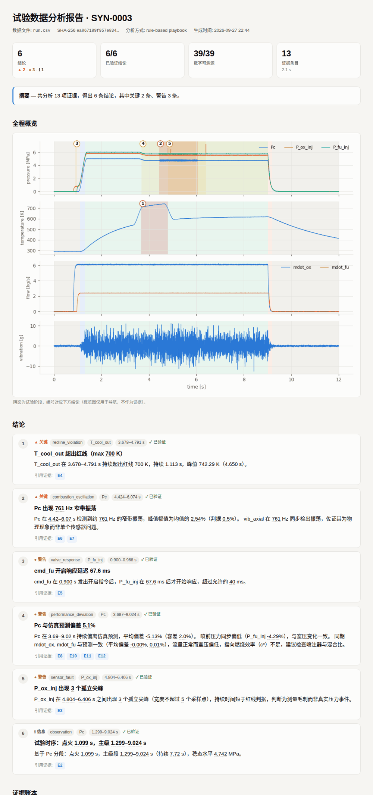

# Groundline

[English](README.md) | 简体中文

**可验证的试验数据分析 agent：报告里的每一个数字都能追溯到一次可复现的计算。**

**[在线演示](https://fhs1220888.github.io/Groundline/demo/)**：在浏览器里用真实点火数据的证据，试试能不能让一个错误的数字骗过校验器。

名字取自 *grounded*（每个数字都有依据）和 *redline*（红线判读）。



把一次发动机热试车（或任何台架试验）的数据交给 Groundline，它会完成工况分段、传感器健康检查、红线判读、阀门响应、振荡检测和仿真对比，然后写出分析报告。和一般的 "AI 分析" 不同的是：

- **数值计算只由确定性工具完成。** 大模型看不到原始数据，只负责决定调用哪些工具、怎么深挖，以及把结果写成人能读的结论。
- **每次工具调用都记入证据账本。** 账本记录参数、数据文件 SHA-256、工具源码哈希、结果和图，报告里的结论只能引用这些证据（E1、E2……）。
- **校验器逐个检查结论里的数字。** 标题和正文里的每个数字都必须能在所引用的证据中找到（允许四舍五入和 s↔ms、比例↔% 换算）。找不到的数字会在报告里用红色波浪线标出；如果用的是 LLM agent，它会收到驳回意见并有一次修正机会。它还检查数字的含义：数字后面写的单位（s、Hz、%、bar、N·s……）要和证据字段的单位对得上；数字前面有“峰值”“持续”“平均”“总冲”这类词时，数字必须来自对应的字段（见[语义校验](#语义校验)）。
- **任何结论都可以复现。** `groundline reproduce report.json` 会用原始数据把账本里的每条证据重新执行一遍，逐条比对结果。

> 状态：v0.1 原型。基准测试用内置合成器生成的数据。另有几份公开的真实试车作为示例：一次固体发动机静态点火（[HANARO](#真实数据示例hanaro-固体发动机静态点火)）、一次液体发动机热试车（[Triton](#真实数据示例triton-液体发动机热试车)），以及四次与团队试验报告对照的混合发动机热试车（[UVic MULE-1](#真实数据示例uvic-mule-1-混合发动机与团队自己的试验报告对照)）。它们都没有附带红线、阀门指令或仿真预测，所以这几项检查仍然只在合成数据上验证过。

## 快速开始

```bash
pip install -e ".[all]"        # 最小安装只需要 numpy/scipy/pandas/matplotlib：pip install -e .

groundline demo                  # 生成一次带异常的合成热试车，并用规则 agent 分析
open groundline_demo/report.html
groundline reproduce groundline_demo/report.json   # 13/13 evidence entries reproduced exactly
```

分析自己的数据（CSV 的第一列为时间，也支持 NI TDMS）：

```bash
groundline analyze path/to/run.csv --reference sim.csv --limits limits.json
```

`limits.json` 的格式可以参考 `groundline synth` 生成的示例，里面包括红线、红线持续时间判据、阀门允许延迟、振荡阈值和仿真偏差容差。

采集系统导出的原始数据很少直接符合 Groundline 的格式。`groundline ingest` 根据一份小的 JSON 映射完成转换，并且能先替你起草这份映射：

```bash
groundline ingest raw_log.csv                         # 写出 raw_log/map.json，并列出它的推断
groundline ingest raw_log.csv --map raw_log/map.json  # 写出 raw_log/run.csv 和 meta.json
groundline analyze raw_log/run.csv
```

草稿会从 `Chamber Pressure (psi)` 这类表头、或名称上方的单位行读取单位（单位行错位一格也能自动对齐），找出时间列，把室压命名为 `Pc`，把多个推力传感器求和成 `F_thrust`，并按单位和名称判断每个通道的类型。它无法知道的，在映射里补上：通道名、时间窗、统一的采样网格（`grid_hz`）、可以跨过的最长缺口（`max_gap_s`，超过就保留为 NaN，让丢帧仍然可见），以及每个通道的 `scale` / `offset`。下文的 Triton 和 UVic 示例就是这样转换的，结果与之前手写的转换脚本完全一致。使用前请先检查草稿，并且不要把试验结果写进 `description`：LLM agent 会读到它。

## 使用大模型

规则 agent（默认）是一套固定的检查流程，不需要任何模型。换成 LLM agent 后，由模型自己规划分析步骤、交叉验证并撰写结论。

最省事的方式是在项目根目录放一个 `.env`（已在 `.gitignore` 中，不会被提交）：

```bash
cp .env.example .env      # 填入 OPENAI_API_KEY，按需改 GROUNDLINE_AGENT / GROUNDLINE_LLM_MODEL
groundline config         # 查看当前生效的配置（key 会打码）
groundline demo           # 之后所有命令默认使用 .env 里的 agent 和模型
```

Groundline 会从当前目录向上查找 `.env`；命令行参数和 shell 里已设置的环境变量优先于 `.env`。也可以不用 `.env`，直接用环境变量或参数：

```bash
# OpenAI
export OPENAI_API_KEY=sk-...
groundline analyze run.csv --agent openai --model gpt-4o-mini

# 任何 OpenAI 兼容接口：Qwen / DeepSeek / vLLM / Ollama 本地部署都可以
export GROUNDLINE_LLM_BASE_URL=http://localhost:11434/v1   # 例如 Ollama
export GROUNDLINE_LLM_MODEL=qwen2.5:32b
groundline analyze run.csv --agent openai

# Anthropic
export ANTHROPIC_API_KEY=...
groundline analyze run.csv --agent anthropic --model claude-sonnet-5-5
```

评测 LLM agent 时，除了检出率，还会统计**初稿中被校验器拦下的编造数字**，以及修正后的结果和 token 用量：

```bash
groundline eval --agent openai --model gpt-4o-mini --n 10 --lang en --out eval_openai.json
```

连接官方 OpenAI 时自动使用 Responses API（推理模型如 `gpt-5.6-sol` 只有在这个接口上才能同时推理和调用工具），推理强度用 `GROUNDLINE_LLM_REASONING_EFFORT` 设置；连接其他 OpenAI 兼容服务时使用 Chat Completions，可用 `GROUNDLINE_OPENAI_API=responses|chat` 强制指定。默认不传 temperature，需要时用 `GROUNDLINE_LLM_TEMPERATURE` 设置。使用 `--agent anthropic` 时，同一个变量设置 effort 档位（`low` … `max`），各步之间复用提示前缀缓存。

试验数据通常很敏感，所以接口按内网私有化部署设计：模型只看到工具的输出摘要，看不到原始数据。

## 作为 MCP 服务器

Groundline 已登记在 [MCP Registry](https://registry.modelcontextprotocol.io)，名称是 `io.github.fhs1220888/groundline`。从 Registry 安装的客户端会用 `uvx groundline mcp` 启动它；也可以手动加到 Claude Desktop、Cursor 等客户端的配置里：

```json
{
  "mcpServers": {
    "groundline": { "command": "uvx", "args": ["groundline", "mcp"] }
  }
}
```

在本地仓库里，`groundline mcp`（或 `groundline-mcp`）会以 stdio 方式运行同一个服务器。

它提供 `open_run`、`list_analysis_tools`、`run_analysis`、`verify`、`write_html_report` 五个工具。任何 MCP 客户端（Claude Desktop、Cursor 或你自己的 agent）都可以充当规划者，校验规则保持不变。

## 分析工具

| 工具 | 作用 |
|---|---|
| `describe_data` | 通道、采样率、单位、NaN 统计 |
| `segment_phases` | 基于室压 10%/90% 划分预试、启动、主级、关机、后处理五个阶段，并记录阀门指令时刻 |
| `check_sensor_health` | NaN 缺失、信号冻结、孤立尖峰（局部稳健 σ） |
| `check_redlines` | 红线判读，带持续时间判据和 5 ms 平滑，短毛刺记为被抑制的瞬态 |
| `measure_valve_response` | 从阀门指令到响应通道起跳的延迟，与允许值比较 |
| `detect_oscillation` | 滑动窗口 FFT，给出窄带振荡的频率、幅值（% of mean）和起止时间 |
| `compare_reference` | 与仿真预测对比：平均偏差、RMSE，以及持续超差的时间段 |
| `pulse_metrics` | 脉冲型通道（如固体发动机推力）的峰值、工作时间、积分（总冲）和平均值 |
| `check_thrust_pressure_ratio` | 推力/室压（均扣除基线）正比于推力系数 × 喉部面积；燃烧中变化超过 50% 时标出（喉部烧蚀或破裂，或传感器失效） |
| `channel_stats` / `plot_window` | 深挖用的统计和作图 |

`groundline tools` 可以查看完整的参数说明。

## 基准测试

合成器可以注入六类已知异常，每次都附带真值：燃烧振荡、冷却剂超温、传感器冻结或缺失、测量尖峰、燃料阀延迟、室压偏低（c* 效率不足）。因此可以对 agent 做定量评测：

```bash
groundline eval --n 50 --seed 1000
```

规则 agent 在 50 次随机试车上的结果如下：

| 异常 | n | 检出率 | 分类正确率 | 起始时刻误差（中位数） |
|---|---|---|---|---|
| oscillation | 15 | 100% | 100% | 12 ms |
| overtemp | 22 | 100% | 100% | 0 ms |
| sensor_dropout | 10 | 100% | 100% | 0 ms |
| sensor_spike | 8 | 100% | 100% | 0 ms |
| valve_delay | 15 | 100% | 100% | 0 ms |
| pc_deficit | 14 | 100% | 100% | 112 ms |

总体精确率为 100%，4 次正常试车上的误报为 0，134/134 条结论通过校验，943/943 个数字可溯源。

这六类异常和检测工具是一起写出来的，所以上表主要说明工具能抓到生成器设计时就要注入的异常。紧接在 LLM 结果之后的两个基准，会一步步去掉这个前提。

LLM agent（`gpt-5.6-sol`，Responses API）在同一组种子的前 14 次试车上（`--n 14 --seed 1000`，含 2 次正常试车，6 类异常全覆盖）：

| 指标 | 规则 agent | gpt-5.6-sol |
|---|---|---|
| 检出率 / 分类正确率 | 100% / 100% | 100% / 100% |
| 精确率 | 100% | 95%（1 条误报） |
| 正常试车上的误报 | 0 | 0 |
| 初稿中编造的数字 | — | 0 / 376 |
| 每次试车 | 1.6 s | 22 s，约 1.9 万输入 / 1,400 输出 token |

唯一的误报是把阀门延迟引起的冷却剂温升滞后单独报成了一条性能偏差，没有归到阀门延迟下面。样本只有 14 次、只跑了一轮，模型输出本身有随机性，这组数字只能作为粗略参考。

第一次评测时精确率只有 36%：37 条"误报"里有 35 条其实是"阀门响应合格""未检出振荡"这类检查通过的结论，被模型填成了异常类别。提示词里补上"非 observation 类别表示发现了异常，检查通过的结论用 observation"之后，精确率升到 95%。评测标准没有改动。

### 真实模型上的出处标注

同样的 14 次合成试车（种子 1000–1013，英文，gpt-5.6-sol，推理强度 low），一组要求给每个数字标出处，一组不要求：

| | 标注 | 不标注 |
|---|---|---|
| 检出率 / 精确率 | 100% / 91%（2 条误报） | 100% / 95%（1 条误报） |
| 正常试车误报 | 0 | 0 |
| 最终报告中标了出处的数字 | 236 / 240（98%） | — |
| 初稿中标错的出处 | 0 | — |
| 初稿中被拦下的数字 | 0 / 242 | 0 / 314 |
| token（14 次） | 输入 277k / 输出 18.5k | 输入 296k / 输出 17.5k |
| 每次用时 | 21 s | 20 s |

标注出处没有可测量的成本，模型几乎给每个数字都标对了出处，于是它的每个数字都只和一个字段核对（下面的植入错误基准里，“放错位置”不标出处抓到 67%，标出处抓到 99.9%）。三条误报是同一个已知错误：把阀门延迟造成的冷却剂温度滞后单独报成偏差。其中一次试车（种子 1010）两组都有，另一次（种子 1001）只出现在标注组。只有 14 次试车，这算不上可测量的差别。标注后报告里的数字更少（240 对 312）。

这次测试还在得出上面的数字之前，发现了我们自己的两个错误。模型把出处写成 `E3.result.issues[0].count`，因为它看到的工具结果包在 `result` 里，冒烟测试里 11 个标注被拒了 6 个；现在接受这种写法，标错时的提示还会说出这个数值实际对应的字段。另外，1126.95 Hz 的振荡写成“1.127 kHz”被拦下，因为 kHz 不是已知单位；现在已经支持。

### LLM agent 在真实试车上的表现

用 gpt-5.6-sol 带出处标注，在每份真实数据上各跑一次。与团队报告和规则 agent 对照：

- UVic 2024-12-12：记录在室压仍在上升时结束，因此无法评估性能和稳定性；截断时刻多个通道同时出现瞬变；一个热电偶没有信号。与团队报告一致。
- UVic 2025-01-18：室压零点偏移、燃烧室热电偶没有信号、压力通道重复，以及推力/室压比在主级段内稳定、主级段之后偏离。
- UVic 2025-02-08：它标出了推力/室压一致性检查不通过，但认为“受传感器影响”（室压有很大的零点偏移），没有指向喉部。规则 agent 把喉部变化列为可能原因之一；两者都说不出具体坏在哪里。
- UVic 2025-09-20：室压饱和、三个热电偶没有信号，以及停车附近的瞬变让峰值不可信。
- Triton：全通道丢帧、减压阀传感器饱和、室压停车后未恢复、孤立尖峰，127 Hz 事件定为警告。
- HANARO：点火正常，推力通道在点火之外有数据缺失。

所有结论都通过校验。得到这些结果之前做了两处修正：

- **我们自己测试里的泄漏。** 第一次在 UVic 上运行时，元数据的描述里引用了每次试验的团队报告（例如“喷管喉衬破裂……”），而 `describe_data` 会把描述交给模型；于是它对 2025-02-08 的报告写了“与报告的喷管/喉部硬件故障一致”。现在团队报告不再放进元数据（只保留在 `prepare.py` 和这里），上面的结果都来自重新运行。规则 agent 从不读取描述，它的结果不受影响。
- **两条提示词规则。** 第一次在 Triton 上运行时，模型漏报了室压停车后未恢复（尽管它读到的传感器健康结果里有这一条），还把 0.58% 的振荡定为关键。现在要求传感器健康检查报出的每个问题都必须体现在报告里，振荡只有达到判据两倍以上才定为关键。在 14 次合成试车上，新提示词保持检出率 100%、精确率 95%（1 条误报，仍是冷却剂温度滞后那个已知错误），97% 的数字标了出处，没有标错。

之前有两次运行用到了修正轮，都是同一个校验器误报：“its maximum 5180.25 psi”标到了 `stuck_value` 字段。现在标了出处的数字也会匹配同一对象里数值完全相同的其他字段，而卡在最大值的问题会额外带一个 `channel_max` 字段。

### 真实场景套件：真实记录里见过的故障和干扰

`groundline eval --suite realistic` 加入了在 Triton 和 UVic 记录里发现的七类故障，每类都有标准答案（全通道丢帧、传感器饱和、停车后室压卡在高位、低于真空的零点偏移、通道重复、通道没有信号、60 Hz 工频干扰），还加入了不应被报告的干扰（低于红线的起动超调、停车水锤、ADC 量化）。原有的经典套件逐个种子保持不变。规则 agent 跑 100 次（`--n 100 --seed 2000`）：13 类全部检出率、精确率和类别准确率 100%，15 次正常试车误报为 0，257/257 条结论通过校验（[明细](docs/results/realistic_suite_rule.json)）。

搭建这个套件时暴露了三个漏洞，现已修复：工频干扰被报成燃烧不稳定（现在点火前就存在的谱线会报告为拾取干扰）；记录在停车后很快结束时，室压卡在高位没有被发现；重复的通道还会额外产生一条虚假的性能偏差。不过和第一张表一样，这些故障是在修复之后才写进来的，所以这个套件更像回归测试，而不是能力测量。

### 混合基准：在真实记录里注入已知异常

`groundline hybrid-bench` 保留真实背景，只让异常是合成的：在一次真实试车里注入一个已知大小、已知时刻的异常，运行规则 agent，再与同样配置下未改动的原始记录对照。这样记录里本来就有的真实问题既不算作检出，也不算误报（注入恰好落在这些问题上的记为“被遮蔽”）。背景用 Triton 热试车和 UVic MULE-1 2025-01-18（HANARO 不适用：它的室压只有 10 Hz，推力通道整段都有丢帧）。每种大小、每个背景注入 5 次，共 270 例（[明细](docs/results/hybrid_bench.json)）：

| 注入的异常 | 按大小的检出情况 |
|---|---|
| 室压振荡（零到峰幅值，占稳态室压的 %；判据 0.5%） | Triton：0.25% 0/5，0.5% 1/4，1% 5/5，2% 4/4，4% 5/5 · UVic：0.25–1% 0/15，2% 2/5，4% 4/5 |
| 室压超过红线（超出时长；持续判据 10 ms） | 5 ms 0/10，10 ms 0/10，20 ms 10/10，50 ms 10/10，200 ms 10/10 |
| 室压低于预测（占稳态室压的 %；容差 2%） | Triton：1% 0/5，2% 0/5，3–8% 15/15 · UVic：被遮蔽（它的室压有已知零点偏移） |
| 推力通道单点尖峰（局部噪声的倍数；判据 12σ） | 6σ 0/10，12σ 3/10，24σ 9/10，48σ 8/10 |
| 推力通道数据缺失 | 10 ms 到 1 s：40/40 |
| 推力通道冻结（最短 50 ms） | 20 ms 4/10，50 ms 到 1 s：30/30 |

**270 例注入里没有产生任何新的误报。** 红线、偏差、缺失和冻结检查在真实噪声上都按设计工作。振荡检测则取决于发动机：在 Triton 液体发动机上，大约从 0.5% 的判据开始就能检出；在燃烧粗糙的 UVic 混合发动机上，宽带燃烧噪声会淹没几个百分点以下的谱线。为此新增了用 0.5 s 长窗口的第二轮搜索，把 UVic 在 2–4% 的检出从 2/10 提高到 6/10。24σ 和 48σ 的漏检，是尖峰恰好落在 Triton 起动压力事件里或紧挨着丢帧处，那里尖峰检测有意降低了灵敏度；20 ms 冻结的 4 次“检出”其实是尖峰检查在信号跳回时触发的，而不是冻结检查。

### 多模型排行榜

`groundline leaderboard` 让多个 agent / 模型跑同一组合成试车，并汇总成一张表（`leaderboard/LEADERBOARD.md`）。模型列表写在 JSON 里，示例见 `examples/leaderboard.json`：规则 agent、gpt-5.6-sol，以及通过 [Ollama](https://ollama.com) 在本地运行的 Qwen2.5 7B / 3B（14B 需要更大内存）。已有的 `groundline eval` 结果可以用 `"from"` 直接导入，不必重跑。结果按模型分别保存，中断后再次运行会接着跑没跑完的模型。

```bash
groundline leaderboard examples/leaderboard.json            # 全部模型
groundline leaderboard examples/leaderboard.json --only "qwen2.5-7b (本地)"
```

表里最关键的一列是**初稿中无出处的数字**：校验器第一次拦下、在所引用证据里找不到的数字，也就是没有校验器时会直接进入报告的数字。检出率按全部试车计算，模型崩溃或没交报告的试车里的异常都算漏检。

2026-09-29 的结果（`--n 14 --seed 1000`，本地模型在 16 GB 内存的 MacBook Pro 上用 Ollama 运行，上下文 16k；原始结果在 `docs/results/leaderboard/`）：

| 模型 | 交出报告 | 检出率（严格 / 宽松） | 精确率 | 正常试车误报 | 初稿中无出处的数字 | 校验后仍无出处 | 秒/次 |
|---|---|---|---|---|---|---|---|
| 规则 agent | 14/14 | 100% / 100% | 100% | 0 | – | 0 | 1.3 |
| gpt-5.6-sol | 14/14 | 100% / 100% | 95% | 0 | 0 / 376（0%） | 0 | 22 |
| Qwen2.5 7B | 11/14 | 5% / 50% | 5% | 0 | 25 / 98（26%），另有 2 个含义不符 | 26 个数字、19 条结论 | 478 |
| Qwen2.5 3B | 13/14 | 0% / 0% | – | 0 | 1 / 1 | 1 个数字、4 条结论 | 28 |

Qwen2.5 7B 前后跑了三次，结果差别很大（交出报告 11 / 7 / 11 次，初稿中无出处的数字 15% / 12% / 23%，均为当时的评分），表里是最后一次，已用当前校验器重新评分（26%），它也是第一次存下了证据账本、可以用新校验器重新校验的一次。

第二次运行时，我们逐条核对了 7B 初稿里被拦下的 10 个数字（用同样的种子重算证据）：

- **4 个是编造的数值**：把 49.9994 kg 的流量积分写成"近 60"；把实际约 10.3% 的最大偏差写成 2.29%；两处凭空写出的时长（"0.86 秒""持续 2 秒"）。
- **6 个是真实数值、但引用了错误的证据**：其中 2 个（主级段起止时刻）被拿来支撑一个错误结论，说冷却剂温度在整个主级段都超限，而实际越限只有 3.95–5.91 s。
- **没有误报**：被拦下的每个数字都对应一个真实的问题。3B 的结果里有 1 处误报，把试车编号"SYN-1013"当成了数值，已修正。

在最后一次运行里，语义校验又多拦下 4 个"有出处、但含义不符"的数字，原来只查出处的校验器会全部放行。逐条看，4 个都是真问题：

- "持续时间约 0.2 秒"：0.2 是流量积分的值，并不是时长。这正是"编的数恰好对上某个无关数字"的漏洞。
- "均值偏差为 0.069%"：证据里的 0.069 是以 MPa 为单位的绝对偏差，不是百分比。
- 两处把流量积分的单位写成 "kg·s"：积分结果应该是 kg。

第一次在真实输出上运行时，语义校验还报了另外 4 处，核对后发现都是校验器自己的 bug：它把 "MPa·s""kg/s·s" 这种复合单位只读到了前半截。现在复合单位会整体读取并约分（kg/s·s = kg）。修正后，在 gpt-5.6-sol 的 60 个数字和规则 agent 的 1884 个数字上仍然没有误报。

这组结果也说明了校验器的边界：

- **修正轮救不回小模型。** 最后一次运行中，7B 用了 9 次修正轮，校验后仍有 26 个数字有问题。校验器的作用是把问题标出来（报告里的红色波浪线），不能指望它让模型改对。
- **对数据的误读查不出来。** 7B 把稳态的氧化剂流量说成"尖脉冲"，引用的数字全部真实、含义也对得上字段，校验器无法发现。语义校验上线前，还有一处编造的"总计 11 秒"碰巧和证据里的某个数在 1% 以内对上，被放行了；这类情况正是[语义校验](#语义校验)要补的漏洞。
- **小模型的主要问题是做不完任务，而不只是编数字。** 7B 每次都有几次在规定步数或时间内交不出报告；3B 大多交了空报告，不说话自然也就不编造。7B 三次运行之间差别很大，样本也小，这些数字只能作为粗略参考。

**这组数字要打折扣看。** 规则 agent 是和这个合成器一起调出来的，满分只能说明管线自洽，不能说明它能处理真实数据。这个基准真正的用途是：

1. 比较不同 LLM agent 的表现，以及它们编造数字的频率；
2. 修改工具时防止回归；
3. 接入更难的场景，比如多异常耦合、真实噪声谱、传感器漂移，以及和真实试车数据的对照。

## 真实数据示例：HANARO 固体发动机静态点火

`examples/hanaro_knsb/` 里是首尔大学火箭队 HANARO 公开的一次 KNSB 固体发动机静态点火（2025 年，数据来自 [snu-hanaro/static-fire-toolkit](https://github.com/snu-hanaro/static-fire-toolkit)，MIT 许可）。原始文件原样放在 `raw/`，`prepare.py` 把它们整理成 Groundline 的输入：

- 推力来自称重传感器，采集时间不均匀、有重复时间戳。去重后插值到 100 Hz 网格，离最近原始样本超过 25 ms 的点保留为 NaN，不掩盖丢帧；
- 公开资料里没有称重传感器的标定常数，所以电压到牛顿的换算用直线拟合 HANARO 自己处理后的推力曲线（R² = 0.9999）；
- 压力来自一台独立的约 10 Hz 记录仪，时钟和推力采集卡不同步。时钟偏差取压力与推力相关性最大的平移量（+5.652 s，相关系数 0.9995）；
- HANARO 没有公布壳体压力或推力的限值，所以不设红线，也没有仿真预测。

```bash
python examples/hanaro_knsb/prepare.py        # 重新生成 run.csv / meta.json / limits.json
groundline analyze examples/hanaro_knsb/run.csv
```

规则 agent 的结果和 HANARO 自己的处理结果对照：

| | Groundline | HANARO 处理结果 |
|---|---|---|
| 推力峰值 | 2222.2 N | 2221.7 N |
| 总冲 | 6362 N·s（按峰值 10% 截取，3.91 s）<br>6391 N·s（按 2% 截取，4.12 s） | 6411 N·s（其截取窗口 4.35 s） |

推力标定本身是拟合 HANARO 的曲线得到的，所以峰值对得上是预期之中的；真正独立的检验是时钟对齐、工作时间和总冲。

另外发现了两处测量问题，都不在点火段内：推力通道有 285 段数据缺失，间隔中位数 0.67 s，规律性很强，更像采集系统周期性丢帧；点火前 121 s 左右推力通道有一个孤立尖峰。

LLM agent（gpt-5.6-sol）在这组数据上给出的 3 条结论与规则 agent 一致（时序、推力性能、推力通道的丢帧和尖峰），25 个数字全部可溯源，初稿没有编造数字。它还主动说明了 Pc 只有 10 Hz、不能用来判断振荡，改用推力通道检查 5–50 Hz 频段，没有发现振荡。4 次请求，约 1.3 万输入 token。

这组数据暴露了几处只按液体发动机合成数据设计的假设，已经修正：
- 慢速记录的通道被插值到快网格上后，振荡检测会去找超过其奈奎斯特频率的成分，尖峰检测会把每个真实采样点都当成尖峰。现在工具会读取 `meta.json` 里的 `native_rate_hz`，在原始采样率上判断；
- 量化后静止的信号（如点火前稳定的环境压力）残差中位数为 0，噪声底被算成 0，一格的跳动就被当成尖峰；
- 点火前后传感器读数本来就不变，不应报"信号冻结"。现在只报告与点火段重叠的冻结；
- 反复出现的丢帧会被合并成一条结论，而不是几百条；
- 点火时推力的快速爬升会泄漏到振荡检测频段的最低一格，被误报成"5 Hz 振荡"。现在峰值落在频段最低一格的窗口不计入；
- 新增 `pulse_metrics` 工具计算推力峰值、工作时间和总冲。

改动后，合成基准测试上规则 agent 的检出率、精确率仍是 100%，0 误报。

## 真实数据示例：Triton 液体发动机热试车

`examples/triton_lox/` 把一次公开的 Triton 热试车数据转换成 Groundline 的输入。Triton 是一台挤压式液氧 / 燃料液体发动机（2025 年 4 月 11 日试车，数据来自 [aidenmccollum/Triton-Hotfire-Analysis](https://github.com/aidenmccollum/Triton-Hotfire-Analysis)）。那个仓库没有声明许可证，所以数据不复制进 Groundline：`prepare.py` 会按固定的提交下载数据，在本地生成 `run.csv`，两者都不进入 git。这是一份约 1.94 kHz、25 个通道的采集记录：三个推力传感器，燃烧室、集液腔、贮箱和减压阀压力，贮箱重量和若干热电偶。数据没有附带红线、阀门指令或仿真预测。

```bash
python examples/triton_lox/prepare.py        # 下载记录，保留 120–180 s，重采样到 2 kHz，丢帧处保留为 NaN
groundline analyze examples/triton_lox/run.csv
```

分段结果与该团队自己分析脚本用的时间窗（记录中的 148.35–153.35 s）一致：点火 148.41 s，主级 148.43–153.16 s，推力工作时间 148.41–153.54 s。峰值推力 1144 lbf，工作时间内平均 846 lbf，总冲 4344 lbf·s（三个推力传感器之和，已扣除基线）；这次试车没有公开的参考值可以对照。

它还发现了数据里的几处测量问题：

- 停车后室压没有回到基线：直到记录结束一直读约 223 psi，试验前是 13.8 psi（相当于稳态水平的 63%），而推力和两个集液腔压力都已回到环境值；
- 燃料减压阀上游压力在整整一分钟里都停在 5180.25 psi，也就是它的最大值，最可能是超出量程饱和了；
- 全部 24 个通道在同一时刻丢数据，共 192 段，最长 42 ms，是采集系统丢帧；
- 点火时五种传感器在 20 ms 内同时出现尖峰；半秒后室压出现一次约 30 ms 的尖峰，冲到 467 psi（+20%）。Groundline 把同时出现的尖峰报告为一个事件，但不替人判断它是真实瞬变还是干扰。

这是 Groundline 第一次碰到液体发动机的真实数据，规则 agent 第一次运行给出了 131 条结论，其中 87 条是同一个卡住的传感器。暴露出的问题和对应的改动：

- 卡住的数值被每一次短暂丢帧切开，每段都算一次冻结 → 冻结段内部的短暂缺失不再切开它；数值卡在通道的最大值或最小值时，标记为可能饱和；
- 所有通道共有的缺失按通道各报一次 → 合并为一条，报告为采集系统丢帧；
- 停车后卡在高位的室压传感器没有被发现，还把“停车”阶段拉长到记录结尾（如果卡在峰值一半以上，还会被算进稳态水平）→ 新增“停车后未回到基线”检查；拖尾在曲线稳定处结束；稳态水平取峰值附近的平台；
- 起动瞬变在单个 50 ms 窗口里产生了“关键”级别的 59 Hz 和 134 Hz “振荡” → 振荡必须持续 3 个窗口，更短的峰单独列为短时事件；
- 多种传感器同时出现的尖峰被说成“测量毛刺，而非真实的物理变化”→ 报告为单个传感器解释不了的一个事件。

改动之后共 18 条结论，全部通过校验（105 个数字）；合成数据基准和 HANARO 的结果都没有变（新的稳态水平估计和之后改为相对基线的阈值，让 HANARO 的点火和主级段边界最多移动了 150 ms）。燃烧期间室压、液氧集液腔和推力里都能看到约 126 Hz 的分量，它是真实的，但很小（平均约为室压的 0.1%）；Groundline 只把其中超过默认 0.5% 判据的一段 0.15 s 标为警告。

## 真实数据示例：UVic MULE-1 混合发动机，与团队自己的试验报告对照

`examples/uvic_mule/` 把 UVic Rocketry 的 MULE-1 混合发动机（N2O / 石蜡）的四次热试车（[UVicRocketry/Propulsion-Test-Data](https://github.com/UVicRocketry/Propulsion-Test-Data)）转换成 Groundline 的输入。它是混合发动机而不是液体发动机，但有液体式的氧化剂供应系统（贮箱、管路、阀门、喷注器），采样约 450 Hz。最有价值的是，团队给每次试验都写了报告，记录当时发生了什么。原仓库没有声明许可证，所以和 Triton 一样，`prepare.py` 负责下载，数据不进项目。

```bash
python examples/uvic_mule/prepare.py          # 四次热试车
groundline analyze examples/uvic_mule/2025-01-18/run.csv
```

| 试验 | 团队的报告 | Groundline（规则 agent） |
|---|---|---|
| 2024-12-12 | 点火器线路短路，两个阀门失电，发动机一点火采集系统就中断了 | “记录在点火过程中中断”：Pc 在 317.48 s 开始上升，记录在 317.53 s 结束，因此不给出性能数据。T_post_comb 没有信号 |
| 2025-01-18 | “第一次完全正常的热试车”；推力比预期低约 25%，原因不明；燃烧室热电偶未安装或损坏 | 两个燃烧室热电偶没有信号（−273.1 °C，传感器开路）。Pc 读数低于真空（中位数 −25.4 psi），是零点偏移。**P_n2_line 与 P_run_tank 逐点完全相同**，报告里没有提到，是接线或配置错误。推力/室压之比在主级段内只变化 9%，但拖尾阶段偏离 62%：推力仍约 330 N，室压只读 24–171 psi |
| 2025-02-08 | 喷管喉衬破裂（喉径扩大约 7 mm），绝热衬套碎裂，没有建立稳定燃烧，推力偏低 | 燃烧期间推力/室压之比变化 79%（1.54 → 2.76 N/psi），正是喉部扩大的特征（或传感器失效）。Pc 有零点偏移；起动时多个通道同时出现尖峰 |
| 2025-09-20 | 没有报告 | 点火期间 Pc 饱和在 2021 psi，因此改用推力分段（1.16–5.67 s；工作时间 4.51 s，总冲 1268 N·s）。停车时一个 10 ms、2343 N 的推力尖峰被识别为尖峰，而不是峰值。三个热电偶没有信号 |

它做不到的：判断推力比预期低 25%（没有公开的预测值）；说出 2025-02-08 具体坏在哪里（只能指向“喉部变化或传感器”）；判断 2025-01-18 拖尾阶段的不一致来自测压孔还是燃烧本身。

和 Triton 一样，第一次运行错得很有启发：从一次噪声跳变和一份点火即中断的记录里分出了阶段，把只是没接上的传感器说成“饱和”，在饱和的 Pc 上分段，把停车时 10 ms 的冲击当成峰值推力，还在不足一个窗口的振荡搜索上崩溃。对应的改动，每一处都是通用的：

- 分段：阈值相对试验前基线计算（零点偏移不再有影响），点火时刻从主级段往回找，Pc 没有清晰脉冲时改用推力，并标出记录在点火中途结束的情况；
- 传感器健康：整段记录只有一个值的是“没有信号”，而不是饱和；物理上不可能的读数（压力低于真空、温度低于绝对零度，持续至少 0.5 s）；逐点相同的通道；
- 新工具 `check_thrust_pressure_ratio`：推力/室压正比于推力系数乘喉部面积，燃烧中应基本不变；只用准稳态窗口，并说明变化是否发生在主级段内；
- 脉冲指标：用 0.1 s 中值定位脉冲，短促的冲击不会被当成峰值。

回归检查：合成数据基准不变（检出率和精确率 100%，134/134 通过校验）；HANARO 的推力结果不变（2222.2 N，6362 / 6391 N·s；基于基线的阈值让点火和主级段边界最多移动 150 ms）；Triton 不变；校验器基准最多变动 1 个百分点，因为工具结果里多了一些字段。

## 语义校验

只检查“数字在引用的证据里出现过”有两个漏洞，在上面 7B 模型的结果里都出现过：真实的数字被放错了位置（引用的数都是真的，意思却错了），以及编造的数字碰巧和证据里某个无关的数在舍入误差内对上。

所以校验器现在会记住每个证据数字来自哪个字段（`peak`、`duration_s`、`freq_hz`……）、带什么单位，再结合句子来读每个数字：

- **单位**：数字后面写了 s / ms，就只能对应时间字段；写 Hz 只能对应频率字段；写 % 只能对应百分比字段；写 bar、K、N·s 这类物理单位，就要和工具报告的单位一致。写出的单位也决定换算：0.8 s 的字段可以写成 800 ms，不能写成 0.8 ms。计数词（“3 个”“3 spikes”）必须来自计数字段或列表长度。
- **角色词**：数字前面紧挨着“峰值 / 持续 / 平均 / 总冲 / 频率 / 偏差 / 延迟”（或对应的英文），数字就必须来自名字对得上的字段。只有角色词直接引出数字时才算数：“持续超出红线 700 K”里的“持续”是副词，“峰值的 10%”说的是峰值的百分之十，这两种都不触发。区间的两个端点（1.27–9.02 s）也不做角色检查；但区间起点沿用终点后面写的单位（所以 1.27 也必须是时间），时间区间也不能终点早于起点。
- **类别**：归入异常类别（红线超限、燃烧振荡、传感器故障、阀门响应、性能偏差）的结论，必须引用对应工具确实报告了这种异常、并且是在该结论通道上的证据；检查通过的结论只能归为 observation。上面第一次 LLM 评测精确率只有 36%，就是这种错误造成的；重新校验存下来的结果后发现，这也仍是 7B 模型最常见的错误：把“阀门响应正常”“未检出明显振荡”归为异常，把普通的峰值数据归为性能偏差。现在它有 5 条结论因此被标出，gpt-5.6-sol 和规则 agent 的结论一条都没有。

整个检查仍然是确定性的字符串和字段匹配，不用另一个大模型来判断。

**标明出处。** 靠猜测判断数字来自哪个字段有上限：两个都是“某个时刻”的数，光看文字分不出来。所以数字后面（单位之后）可以用方括号写明它来自哪个字段：`742.3 K [E4.violations[0].peak_value]`、`3 个尖峰 [len(E3.issues[0].spikes)]`、`3.86 [E6.events[0].t_start]–6.01 s [E6.events[0].t_end]`。标了出处的数字只和那个字段核对（数值、单位、角色词、区间先后）；标错字段、或者指向结论没有引用的证据，都会被标出。单写 `[E4]` 仍然只是普通引用。HTML 报告里，这些标注会变成跳到对应证据的链接。LLM agent 会被要求给每个数字标出处（设 `GROUNDLINE_CITE_NUMBERS=0` 可关闭），MCP 客户端也可以这样写。没有标注的数字仍按原来的方式校验。

单位换算现在也和字段类型绑定：s ↔ ms 只用于时间字段，小数 ↔ % 只用于无单位的比值。802 Hz 的频率不会再和写出来的 8（×0.01）对上，0.5 % 的判据也不会再和“50 %”对上。

**校验器自己的考试**（`groundline verifier-bench`）：在规则 agent 生成的正确结论里，每次只改一个数字，植入三类已知错误，分别看三种情况各抓到多少：只查数值是否出现在引用的证据里；对未标注的文本做完整校验；每个数字都标明出处时做完整校验。100 次合成试车，中英文各 50 次：

| 植入的错误 | 数量 | 只查出处 | 出处 + 语义 | 数字标明出处时 |
|---|---|---|---|---|
| 编造的数值（改动 −30% 到 +50%） | 1366 | 89% | **98%** | **100%** |
| 真实数值放错位置（换成同一条证据里的另一个字段） | 1438 | 0% | **67%** | **99.9%** |
| 单位写错（s ↔ Hz、% → s……） | 1170 | 0% | **98%** | **100%** |
| 未改动的正确结论（误报） | 268 | 0% | **0%** | **0%** |

不标出处时，“放错位置”抓到 67%，要分两种情况看：换成不同类型的字段（比如把时长换成峰值压力）抓到 92%；换成同类型字段（比如把起始时刻换成另一个时刻）抓到 34%，只有句子里有角色词、替换后时间区间倒序、或者 s/ms 换算对不上时才能发现。（加入区间、换算、计数和单位换算规则之前分别是 45%、69% 和 13%。）这是只读文字的上限；数字标明出处后，3,974 个植入错误只漏掉 1 个（换进来的数值恰好在舍入范围内等于所引用的字段）。LLM agent 能不能稳定地标好出处还没有测过：上面的基准测试结果都是在加入这条要求之前跑的。

另外要注意，这些角色词规则是对着规则 agent 的模板句式写的，上表的误报率在它自己的句式上测出来，天然偏乐观。在独立的文本上，也就是 gpt-5.6-sol 写的两份报告（9 条结论、60 个数字，包括 HANARO 真实数据那份），新校验器同样没有误报；加入区间、换算和计数规则后，用 `reverify` 重新校验存下来的 gpt-5.6-sol 和 Qwen 基准结果（gpt-5.6-sol 共 123 条结论、798 个数字），gpt-5.6-sol 没有一条判定发生变化。7B 的初稿里多拦下了两个数字，都是错的：一个“持续时间约 0.2 秒”只是碰巧等于总冲 19.4 的 ×0.01，另一个是把以 MPa 计的平均偏差 ×1000 写成了百分比。但要更可靠地估计误报率，还需要更多不同模型写的真实报告。

LLM 基准测试会把每次试车的结论和证据账本一起存下来。校验器再改进时，可以用 `groundline reverify <结果.json>` 直接重新校验，不必重跑模型。上面 7B 最后一次运行的结果（`docs/results/leaderboard/`）就是这样重新评分的。

## 设计要点

- **LLM 不做算术。** 系统提示明确要求结论里的每个数字都来自证据。比如模型想说"偏差 5%"，就必须调用 `compare_reference` 拿到这个数，而不是自己用两个数相减。
- **规则 agent 也要过校验。** 开发过程中，校验器抓到了规则模板里写死的"5 个采样点"：这个判据当时没有出现在证据里。修复方法是把判据写进工具输出，而不是放宽校验。
- **会归因的结论。** 如果流量和预测一致而室压偏低，报告会指向 c* 效率不足；如果燃料阀开得晚导致点火推迟，由此产生的温升滞后会被归到阀门延迟下面，而不是单独报成一个问题。

## 目录结构

```
src/groundline/
  synth.py        合成热试车数据和异常真值
  io.py           CSV / TDMS 读写
  session.py      Session 与证据账本
  tools.py        确定性分析工具（全部数值来源）
  findings.py     结论数据结构与数字溯源校验器
  semantics.py    语义校验：单位、角色词与证据字段是否对得上
  agent.py        规则 agent、LLM agent（OpenAI Responses / 兼容接口 / Anthropic）
  report.py       自包含 HTML 报告和 report.json
  reproduce.py    证据复现
  evaluate.py     基准评测与重新校验
  leaderboard.py  多模型排行榜
  verifier_bench.py  校验器自己的评测（植入错误）
  hybrid.py          混合基准：在真实记录里注入已知异常
  ingest.py          根据（自动起草的）映射把原始 CSV 记录转换成试车数据
  mcp_server.py   MCP 服务器
  config.py       .env 配置加载
  cli.py          命令行
```

## 路线图

- [ ] 在更多液体发动机真实试车数据上验证判据、校准阈值，最好带红线、阀门指令和仿真预测（已有一次公开的固体发动机示例和一次公开的液体发动机示例）
- [ ] 偏差归因：仿真和实测对不上时，按机理、网格、边界条件、制造偏差、传感器分别列出候选原因并设计验证
- [ ] 多次试车横向对比与趋势分析
- [x] LLM agent 排行榜与校验器评测
- [ ] 更难的合成场景（多异常耦合、真实噪声谱、传感器漂移）
- [ ] 试验报告模板（Word/PDF 导出）

## License

MIT
